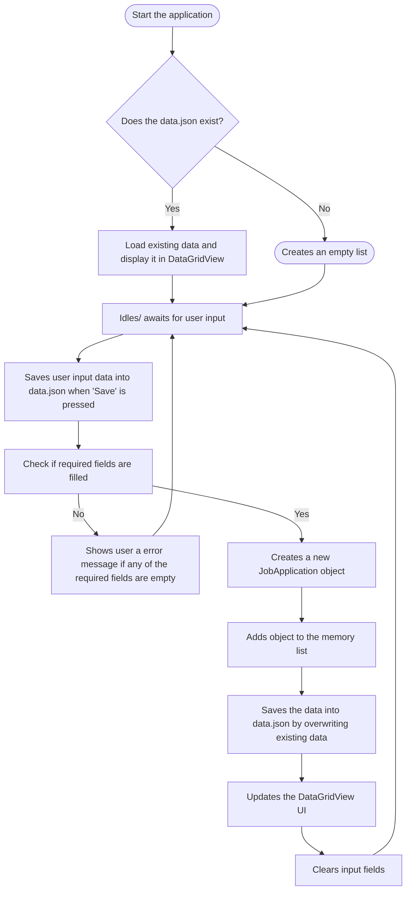
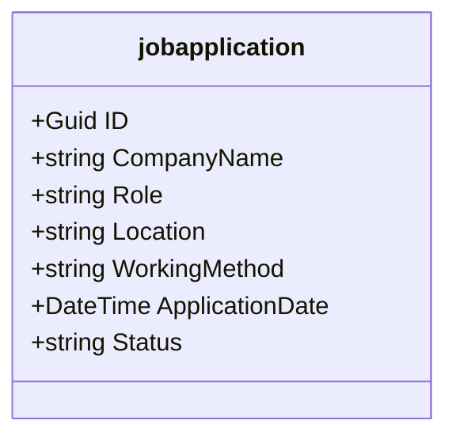

# Job-application-tracker

## Description
GUI for tracking ongoing job applications and their current states.

## Features
### Data that can be saved
- Company name
- Location
- Work form(on-site, remote, hybrid)
- Date of the sent application
- Status of the application
### Data saves locally into JSON file
### Edit saved data

## Technologies
- C# and .NET
- Windows Forms (UI)
- JSON (Local data persistance)

## Data Structure and Logic

## Usage Instructions

1. **Launch the Application:** Start the application. It will automatically check for an existing `data.json` file and load your saved applications into the grid[cite: 1]. If it is your first time opening the app, it will create an empty list[cite: 1].
2. **Add a New Entry:** Fill out the input fields with the details of your job application, including the company name, role, location, work form, application date, and status[cite: 1]. 
3. **Save the Data:** Press the 'Save' button[cite: 1]. The application will validate that the required fields are filled[cite: 1]. If successful, it creates the new entry, overwrites the local JSON file with the updated data, and refreshes the UI[cite: 1].
4. **Edit or Delete:** To modify your saved data[cite: 1], click the pencil (edit) or trash can (delete) icons located on the right side of each row in the data grid.
5. **Sort and Filter:** Click on any column header (e.g., "Company Name" or "Date") to sort the list. Click the "Filter" button to open a menu where you can isolate applications based on specific statuses or work models without deleting your master data.
6. **Dark Mode:** Click the toggle switch in the top right corner of the interface to swap between Light and Dark themes.
### Class Diagram
The application uses a specific data model for job applications

## Project steps
 1. Visual Layout
    - Build the UI.
 3. Data Managment
    - Convert C# data into JSON and save it to local hard drive.
 5. Wiring the events
    - Connect Forms buttons to the logic.
