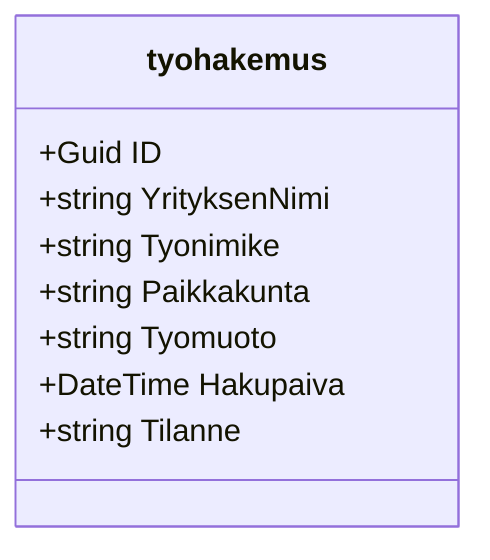

# Job-application-tracker

## Description
GUI for tracking ongoing job applications and their current states.

## Features
* Data that can be saved
- Company name
- Location
- Work form(on-site, remote, hybrid)
- Date of the sent application
- Status of the application
* Data saves locally into JSON file
* Edit saved data

## Technologies
- C# and .NET
- Windows Forms (UI)
- JSON (Local data persistance)

## Data Structure and Logic

### Class Diagram
The application uses a specific data model for job applications

## Project steps
 1. Visual Layout
    - Build the UI.
 3. Data Managment
    - Convert C# data into JSON and save it to local hard drive.
 5. Wiring the events
    - Connect Forms buttons to the logic.
